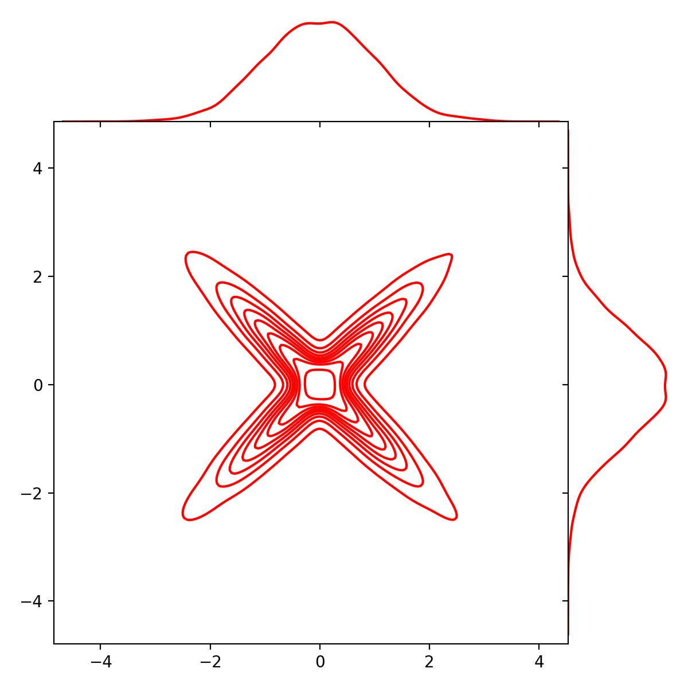
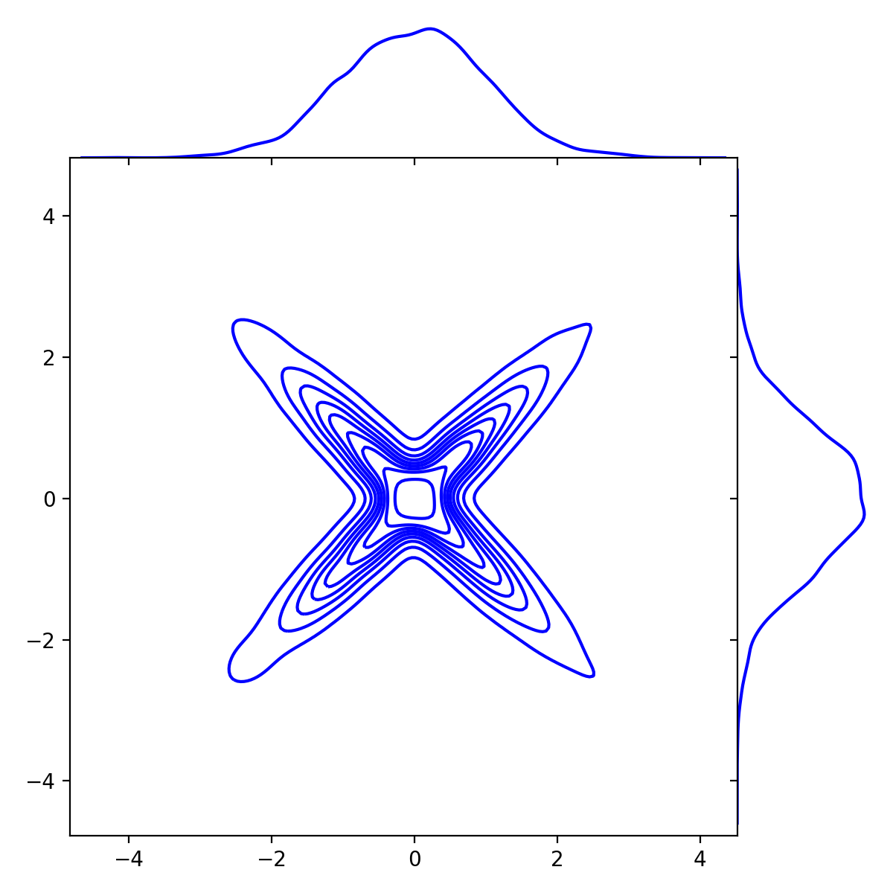

The goal of this project to sample points from a multi-dimensional empirical data source using only the samples, without any knowledge of the underlying distribution. This is similar to generative modeling, where new distinct samples resembling the given data are generated. Where this differs from sampling from the empirical distribution (as in bootstrap) is that the newly-generated data points are not identical to a point in the given sample. Currently, the algorithm is only feasible for low-dimensional data, but I am working on optimizing it for high-dimensional data.

# Running the Code
Running the code is easy and can be done in three lines of code.

First, you need to import the main project file using the command

1. `from distribution_approximator import SampleGenerator` 

Then, create a new SampleGenerator object using your data source stored as a numpy array, with the rows containing each data point and the columns containing the entries of the data points. 

2. `sg = SampleGenerator(data_array, precision=None, density=None, delta=None)`

There are three parameters that can optionally be set:
* `precision`: Controls the number of regions the sample space is divided into. Larger values mean the estimated distribution will more closely match the given empirical distribution. Beware of overfitting when this is too high.
* `density`: Controls how densly packed the points in each region are distributed. This parameters is the number of peaks in the tentmap (see below).
* `delta`: Controls the minimal mass that can be assigned to a region of the sample space. Setting this too high will lead to a high probability of non-representative samples. Make sure not to set `delta` to be lower than `1/(precision*(precision-1))` -- otherwise some of the regions will be assigned negative mass.

Finally, we can generate new samples using the following command.

3. `samples = sg.sample_points(n_points=1000)`

There is one parameter for this function.
* `n_points`: sets the number of new samples to generate.

# Examples
You can generate the following two examples by running `examples.py`.

* 3D Example: Here we use a data sample consisting of five three-dimensional points. This example illustrates how the algorithm works. The algorithm divides up the sample space into `precision**dimension` boxes. The probability mass assigned to each box is proportional to the number of data points from the sample falling into that box. In the examples, the red points are the original data sample, while the blue points are newly-generated points using the algorithm. 

* 2D Example: Here, we generate points from a two-dimensional normal distribution with dependent coordinates. The plots are KDE-smoothed versions of first the original sample in blue, then the newly-generated sample from the distribution estimated using the algorithm, and finally the two plot superimposed on top of each other for comparision. As you can see, the algorithm does a pretty good job.

The two main ingredients of the approximator are the following:
# Piecewise-Linear Function
A piecewise-linear function is a from the interval [0,1] to an interval [0,c], where c is any positive real number with associated input breakpoints such that the function is linear between each pair of input breakpoints. The output breakpoints are the corresponding breakpoints determined by the slopes of these linear pieces and the input breakpoints.

# Tentmap / Sawtooth Function
Tentmap functions and sawtooth functions are two names for the same thing. Esentially, a sawtooth function oscilates up and down on the interval [0,1] in a straight line, where we specify the number of pieces that we want. The higher the number of pieces, the more oscilations we have. This allows us to fill higher-dimensional space.
